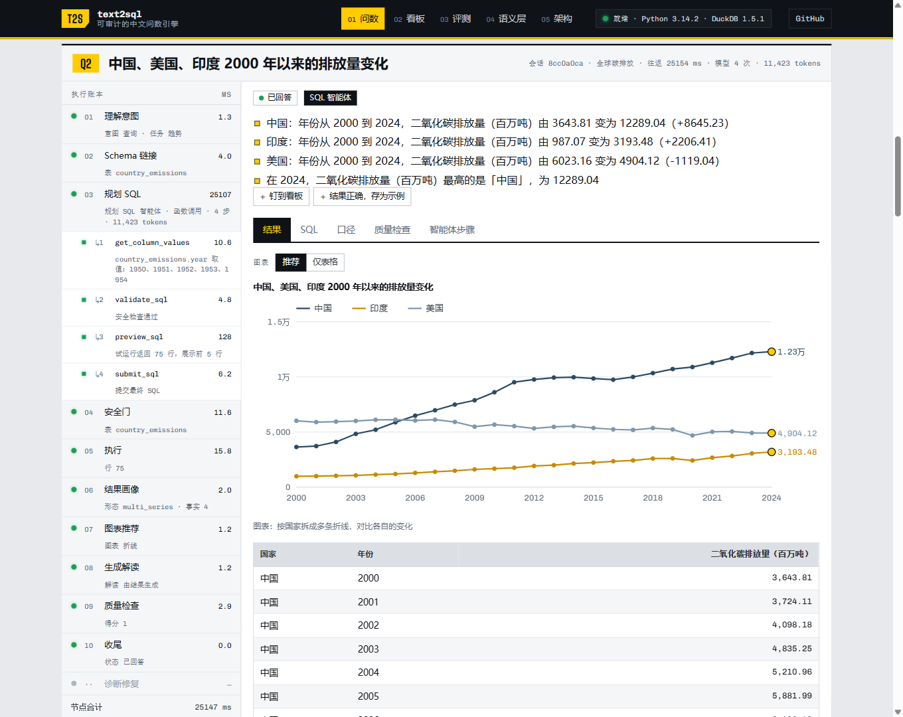
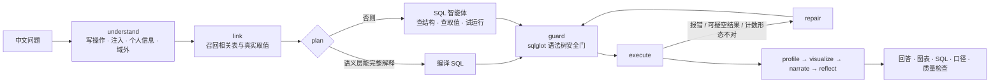

# text2sql-chatbi

中文问数（ChatBI）智能体。语义层把业务口径编译成确定的 SQL，覆盖不到的问题交给带工具的 SQL 智能体；
每条 SQL 执行前过语法树安全门和代价预估，执行后做结果检查，答不准的宁可放弃。

**在线体验：<https://text2sql-chatbi.gaaiyun-risk-selfcheck.workers.dev>**
Python 与 DuckDB 编译成 WebAssembly 跑在你的浏览器里，模型经 Cloudflare Worker 调用 Workers AI，不需要任何账号或 Key。

[](https://github.com/gaaiyun/text2sql-chatbi/actions/workflows/ci.yml)




## 能做什么

- **六个数据集**：合成的智能制造企业库（手写语义层）、连锁茶饮门店示例、Northwind、Chinook、Gapminder、
  Our World in Data 碳排放，另外可以拖进自己的 CSV / Excel / Parquet / JSON。
- **两条规划路径**：企业库的常见问题由语义层编译，零模型调用、不会答错；长尾问题、开源数据集和上传文件交给 SQL 智能体，
  它用函数调用查结构、查真实取值、试运行，最后提交 SQL。
- **看得见的过程**：执行账本逐节点显示耗时与判断，SQL 智能体的每次工具调用都有记录；口径、质量检查、安全门改写一并给出。
- **ChatBI 的交互**：图表可以换（多序列自动拆成多条折线）、SQL 可以改了重跑、结果可以钉到看板、回答正确可以存为示例，
  之后相似的问题会参考它。
- **多种接入**：网页、CLI、FastAPI（REST + SSE）、MCP server（接 Claude Desktop 等客户端）、Streamlit、Docker。

## 评测

62 题评测集，判分比较执行结果而不是 SQL 文本。方法、分类别结果与两轮运行之间的修正见 [docs/EVALUATION.md](docs/EVALUATION.md)。

| 路径 | 覆盖率 | 作答精确率 | 执行准确率 | 拒答准确率 |
|---|---:|---:|---:|---:|
| 离线语义层（零模型调用） | 83.6% | 100% | 83.6% | 100% |
| 语义层优先，Workers AI 兜底 | 100% | 98.2% | 98.2% | 100% |

## 工作原理



- **安全门**在语法树上判断：只允许单条只读语句，表走白名单，逐列校验字段并给出相近字段，拦截个人信息字段、
  系统函数和跨库访问，收紧 LIMIT，EXPLAIN 估算代价。
- **静默错误**比报错更危险：`WHERE status = '存续'` 能执行但返回 0 行。值索引扫描真实取值，空结果且取值不存在时带着真实取值修复。
- **编排器可替换**：路由写成声明式的表，服务端用 LangGraph（检查点保存会话），浏览器里用顺序执行器，测试逐题核对两者输出一致。
- **语义层是配置**：企业库的口径写在 YAML 里；新数据集导入时自动画像，开源数据集再叠一张人写的数据卡片。

详见 [docs/ARCHITECTURE.md](docs/ARCHITECTURE.md)（分层、工作流、智能体时序、浏览器引擎）与 [docs/DESIGN.md](docs/DESIGN.md)（设计取舍）。

## 快速开始

```powershell
git clone https://github.com/gaaiyun/text2sql-chatbi
cd text2sql-chatbi
python -m venv .venv; .\.venv\Scripts\activate
pip install -e ".[dev]"

python -m text2sql ask "近三年每年的融资事件数"      # 首次运行自动生成合成演示库
python -m text2sql eval --gate                       # 离线评测
python -m text2sql serve                             # FastAPI：http://127.0.0.1:8000/docs
streamlit run streamlit_app.py                       # 界面
python -m text2sql mcp                               # MCP server（stdio）
```

不配置任何东西即可运行（演示库 + 语义层）。接入模型与只读 MySQL 时复制 `.env.example` 为 `.env` 填写；
Docker、Cloudflare 站点与全部配置项见 [docs/DEPLOYMENT.md](docs/DEPLOYMENT.md)。

## 数据集与许可证

| 数据集 | 内容 | 来源 | 许可证 |
|---|---|---|---|
| 智能制造企业 | 5,000 家企业的工商、行业、融资、投资、招投标、资质（合成） | 按生产表结构生成 | MIT |
| 连锁茶饮门店 | 8 家门店 18 个月销售明细（合成） | 本项目 | MIT |
| Northwind 贸易 | 订单、明细、产品、客户、员工、供应商 | microsoft/sql-server-samples | MIT |
| Chinook 数字音乐商店 | 发票、曲目、流派、艺人、客户 | lerocha/chinook-database | MIT |
| Gapminder 全球发展 | 142 个国家 1952–2007 人口、寿命、人均 GDP | jennybc/gapminder | CC0 |
| 全球碳排放 | 219 个国家或地区 1950–2024 排放、能源、GDP | Our World in Data | CC BY 4.0 |

开源原始文件固定到具体提交并校验 sha256，由 `scripts/opendata.py` 转成 Parquet；中文国家名与数据卡片由本项目编写。

## 项目结构

```text
text2sql/
  agent/        工作流节点、SQL 智能体与工具箱、意图、召回、值索引、结果画像、图表、解读、质量检查、修复
  semantic/     语义层目录、规则解析器、计划编译、逐词解释
  sql/          安全门
  db/           DuckDB / MySQL 后端、代价估算、合成演示库
  datasets/     企业库语义层与评测集、数据卡片、上传导入与画像
  evaluation/   结果集比较与指标
  api/ ui/ web/ FastAPI、Streamlit 组件、浏览器引擎入口
  cli.py  mcp_server.py
site/           网页（src）、Cloudflare Worker（worker）、wrangler 配置
scripts/        站点构建、开源数据集转换、安全扫描、部署检查
tests/          36 个测试文件
docs/           架构、设计、评测、部署、交接
```

## 文档

- [docs/ARCHITECTURE.md](docs/ARCHITECTURE.md)：架构与数据流
- [docs/DESIGN.md](docs/DESIGN.md)：设计取舍
- [docs/EVALUATION.md](docs/EVALUATION.md)：评测方法与结果
- [docs/DEPLOYMENT.md](docs/DEPLOYMENT.md)：部署与配置
- [SECURITY.md](SECURITY.md)：安全措施
- [CHANGELOG.md](CHANGELOG.md)：更新记录

## 许可证

代码以 MIT 许可证发布。开源数据集遵循各自的许可证（见上表）。
