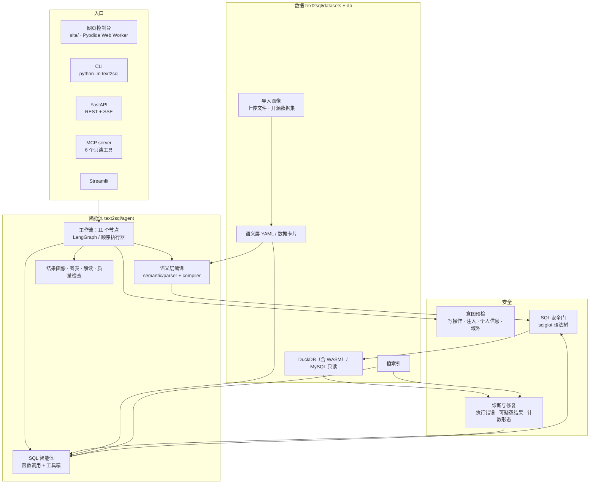
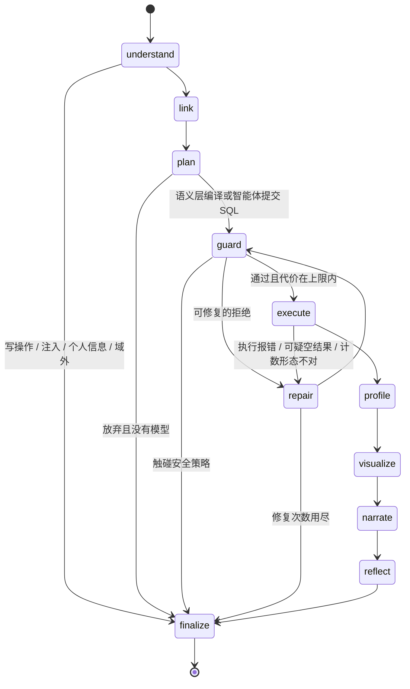
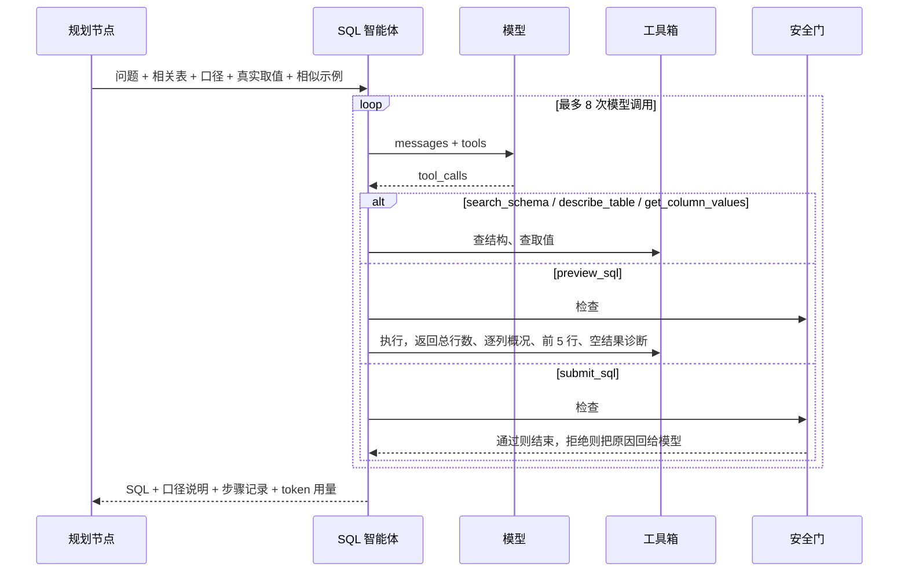
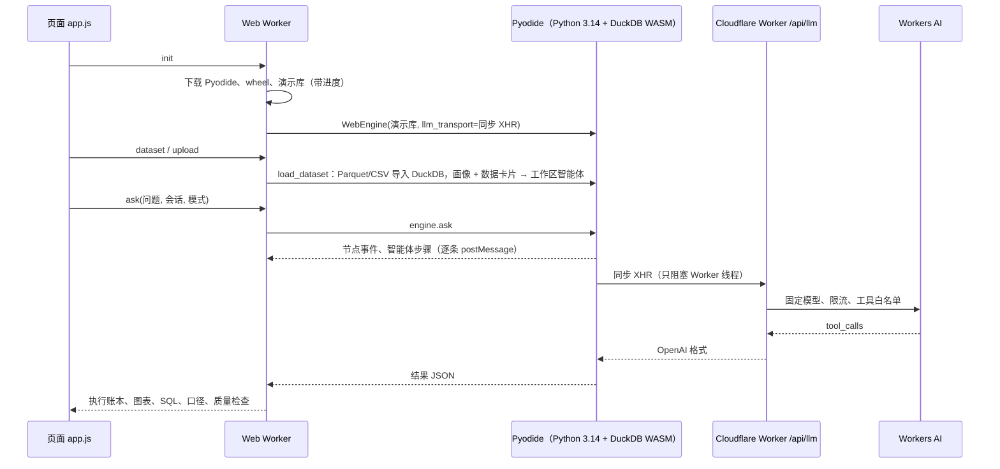
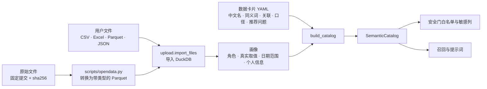

# 架构

> 设计取舍见 [DESIGN.md](DESIGN.md)，评测方法与结果见 [EVALUATION.md](EVALUATION.md)，部署见 [DEPLOYMENT.md](DEPLOYMENT.md)。

## 1. 分层

| 目录 | 职责 |
|---|---|
| `text2sql/agent/` | 工作流节点与路由表（`graph.py`）、顺序执行器（`runner.py`）、SQL 智能体与工具箱、意图、召回、示例检索、值索引、结果画像、图表、解读、质量检查、修复诊断 |
| `text2sql/semantic/` | 语义层目录加载与校验、规则解析器、计划编译器、解析调试（逐词解释） |
| `text2sql/sql/` | 安全门：只读、表白名单、列校验、敏感列、函数白名单、LIMIT 收紧 |
| `text2sql/db/` | DuckDB / MySQL 后端、EXPLAIN 代价估算、查询超时、合成演示库生成 |
| `text2sql/datasets/` | 企业库语义层与评测集、数据卡片、上传文件的导入与画像、示例数据 |
| `text2sql/evaluation/` | 结果集比较、指标计算、Markdown 报告 |
| `text2sql/api/`、`cli.py`、`mcp_server.py`、`ui/` | 各入口 |
| `text2sql/web/` | 浏览器引擎入口（`WebEngine`）与同步 XHR 模型传输 |
| `site/` | 页面、Web Worker、Cloudflare Worker、构建脚本产物 |
| `scripts/` | 站点构建、开源数据集转换、安全扫描、部署检查 |

## 2. 一次提问的工作流

路由写成声明式的表（`FIXED_EDGES`、`CONDITIONAL_EDGES`），LangGraph 和浏览器里的顺序执行器读同一张表，
测试逐题核对两者输出一致。

| 节点 | 做什么 |
|---|---|
| understand | 确定性规则挡掉写操作、提示词注入、个人信息请求和领域外问题；识别任务类型与 Top N；追问改写 |
| link | 按表名、中文名、同义词、字段名与问题中的真实取值给表打分，选出相关表 |
| plan | 语义层能完整解释问题就编译成 SQL；否则交给 SQL 智能体（有模型时） |
| guard | sqlglot 解析后逐层检查，失败时给出相近字段等修复线索；EXPLAIN 估算代价 |
| execute | 只读执行；0 行且条件取值不存在、问“有多少”却按分组返回多行 1 → 进入修复 |
| repair | 把诊断和真实取值作为反馈交给 SQL 智能体重写 |
| profile / visualize | 识别结果形态（单值、类别对比、时间序列、多序列长表、宽表多指标、明细），计算事实，推荐图表 |
| narrate | 默认由事实直接生成解读；启用模型解读时，解读里的数字必须能在事实中找到 |
| reflect | 截断、排名数量、时间顺序、空值分组等 8 项质量检查 |
| finalize | 写入会话历史，供追问改写使用 |

## 3. SQL 智能体

- 最后一次调用前提示模型提交；步数用尽时采用最后一次试运行成功且有数据的 SQL，并在口径里写明；
- 服务商不支持函数调用时降级为单轮提示；
- 页面上确认正确的问答进入当前数据集的示例库，之后相似的问题会在提示词里参考它。

## 4. 浏览器里的引擎

LangGraph 依赖的原生扩展装不进 Pyodide，所以浏览器里换成顺序执行器；节点、路由表、安全门、评测代码与服务端相同。
WebAssembly 没有线程，查询超时中断在浏览器里不可用，代价估算仍然生效。

## 5. 数据集与语义层

企业库（znjz）有手写的完整语义层：实体、指标、维度、筛选、取值映射，规则解析器据此编译 SQL。
开源数据集和上传文件没有手写语义层，只走 SQL 智能体，但同样有目录：画像给出能验证的事实，卡片补上人写的业务知识。
