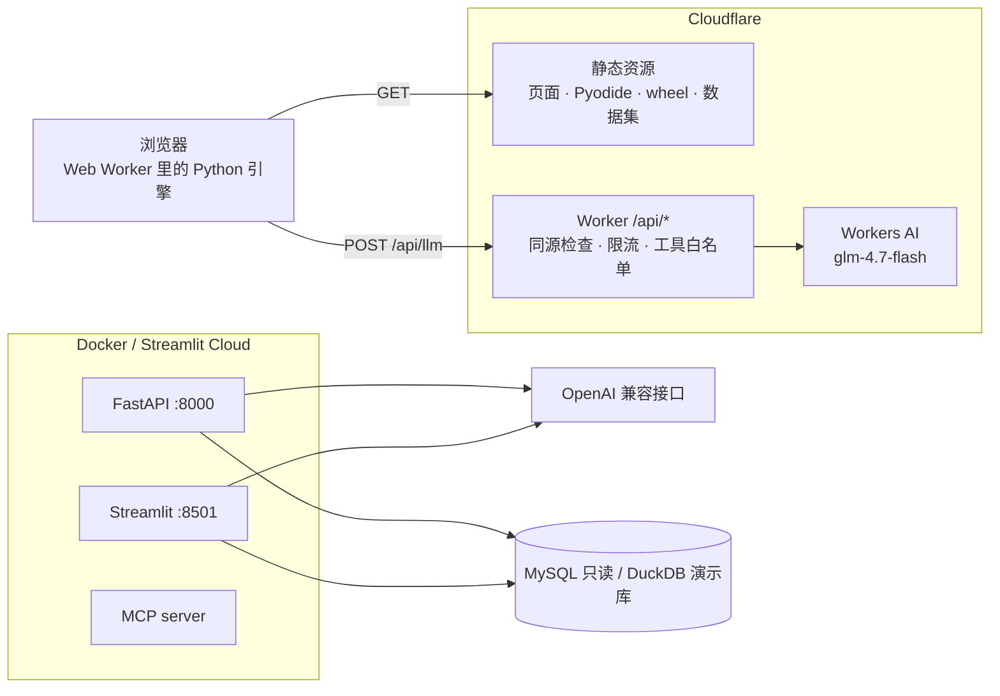

# 部署

同一份代码有四种运行方式，按需要选：

| 方式 | 适合 | 模型 | 数据 |
|---|---|---|---|
| Cloudflare Workers 站点 | 公开演示、分享链接 | Workers AI（账号免费额度） | 浏览器内 DuckDB：演示库、开源数据集、上传文件 |
| Docker（接口 + 界面） | 本地或服务器一键运行 | 任意 OpenAI 兼容接口 | 演示库或只读 MySQL |
| Streamlit Cloud | 只要界面 | 同上 | 同上 |
| CLI / MCP | 调试、接入 Claude Desktop 等客户端 | 同上 | 同上 |



## 1. Cloudflare Workers 站点

站点是 Workers 静态资源 + 一个只处理 `/api/*` 的 Worker（`site/wrangler.jsonc`）：

- 静态资源直接由 Cloudflare 返回，不计入 Worker 调用次数；
- `/api/health` 告诉页面是否绑定了 Workers AI；
- `/api/llm` 把浏览器里 SQL 智能体的请求转发给 Workers AI，只接受同源请求，按 IP 限流（每分钟 30 次），
  限制请求体大小、工具名单和 `max_tokens`，页面里没有任何密钥。

```powershell
# 1. 构建：复制页面、打包 wheel、准备 Pyodide、生成演示库、转换开源数据集、预计算评测
$env:T2S_SITE_CACHE = "G:\dev-cache\text2sql-site"   # 下载缓存，重复构建不再联网
python scripts/build_site.py

# 2. 部署（首次会打开浏览器登录 Cloudflare）
cd site
npx wrangler@4 deploy
```

构建产物约 27 MB，单个文件都在 25 MB 限制内。Workers AI 免费额度每天 10,000 neurons：
一道长尾问题通常 3 到 8 次模型调用、1 万到 2.5 万 token。额度用尽时 Worker 返回明确提示，
语义层能回答的问题不受影响（零模型调用）。

本地预览不含 Worker（没有 `/api/llm`），页面只启用语义层：

```powershell
python -m http.server 8622 --directory site/dist
```

## 2. Docker

```powershell
copy .env.example .env    # 可选：填模型 Key 和只读数据库
docker compose up --build
```

- 接口：<http://localhost:8000/docs>（`/health`、`/api/v1/query`、`/api/v1/query/stream`）
- 界面：<http://localhost:8501>

镜像以非 root 用户运行，构建时生成演示库，`.dockerignore` 排除了 `.env` 与 `secrets.toml`。

## 3. Streamlit Cloud

- Repository：本仓库，Branch：`main`，Main file path：`streamlit_app.py`
- Secrets：复制 `.streamlit/secrets.toml.example` 的内容再替换取值

不配置任何 Secrets 也能运行：使用合成演示库和语义层路径。

## 4. CLI 与 MCP

```powershell
pip install -e ".[dev]"
python -m text2sql ask "近三年每年的融资事件数"
python -m text2sql serve --port 8000
python -m text2sql mcp                      # stdio，给 Claude Desktop 等客户端用
python -m text2sql doctor                   # 检查配置、数据库和模型连通性
```

Claude Desktop 的 `claude_desktop_config.json`（`command` 填安装了本项目的 Python 解释器）：

```json
{
  "mcpServers": {
    "text2sql": {
      "command": "D:/path/to/text2sql-chatbi/.venv/Scripts/python.exe",
      "args": ["-m", "text2sql", "mcp"]
    }
  }
}
```

MCP server 提供 6 个只读工具（`ask_database`、`search_schema`、`describe_table`、`get_column_values`、
`run_readonly_sql`、`describe_semantic_layer`）、一个语义层资源和一个分析提示词模板。

## 5. 配置项

所有配置来自环境变量、`.env` 或 Streamlit Secrets（同名键）。`scripts/check_deploy_readiness.py`
会核对下表与 `text2sql/config.py` 一致。

| 键 | 默认 | 说明 |
|---|---|---|
| `LLM_PROVIDER` | `openai_compatible` | `openai_compatible` 或 `deepseek` |
| `OPENAI_API_KEY` | — | 不填时只启用语义层路径 |
| `OPENAI_BASE_URL` | `https://api.openai.com/v1` | 任意 OpenAI 兼容接口 |
| `OPENAI_MODEL` | `gpt-4o-mini` | 需要支持函数调用 |
| `DEEPSEEK_API_KEY` / `DEEPSEEK_BASE_URL` / `DEEPSEEK_MODEL` | — | `LLM_PROVIDER=deepseek` 时读取 |
| `MODEL_TEMPERATURE` | `0.1` | |
| `LLM_TIMEOUT` | `60` | 秒 |
| `T2S_AGENT_MAX_STEPS` | `8` | SQL 智能体每轮最多调用模型的次数 |
| `APP_PASSWORD` | 空 | Streamlit 与接口的访问口令，空表示不设 |
| `T2S_DATABASE` | `auto` | `auto`：配置了主机就连 MySQL；`demo` / `mysql` 强制指定 |
| `T2S_DEMO_DB_PATH` | `data/demo/znjz_demo.duckdb` | 首次运行自动生成 |
| `DB_HOST_SCENARIO_1_3` | — | MySQL 主机（沿用 v1 变量名） |
| `DB_PORT_SCENARIO_1_3` | `3306` | |
| `DB_NAME_SCENARIO_1_3` | `znjz` | |
| `DB_USER_SCENARIO_1_3` | — | 建议使用只读账号 |
| `DB_PASSWORD_SCENARIO_1_3` | — | |
| `T2S_MAX_ROWS` | `500` | 结果行数上限，安全门会收紧 LIMIT |
| `T2S_MAX_REPAIRS` | `2` | 执行失败或可疑结果时的修复次数 |
| `T2S_QUERY_TIMEOUT` | `20` | 秒，超时中断查询 |
| `T2S_COST_LIMIT` | `50000000` | EXPLAIN 估算的处理行数上限 |
| `T2S_LLM_NARRATIVE` | `true` | 解读是否调用模型；关闭后由结果直接生成 |
| `T2S_ALLOWED_ORIGINS` | `*` | 接口的跨域来源，逗号分隔 |
| `T2S_RATE_LIMIT` | `30/minute` | 接口按 IP 限流 |

## 6. 发布前检查

```powershell
python -m ruff format --check text2sql tests scripts
python -m ruff check text2sql tests scripts
python -m pytest
python scripts/check_security.py          # 公网 IP、Key、口令、DEFINER
python scripts/check_deploy_readiness.py  # 部署文件、配置文档、Worker 防护、CSP、镜像用户
python -m text2sql eval --gate            # 离线评测门禁
```
