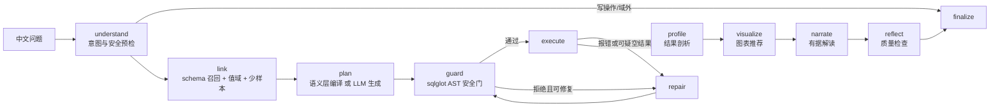

# 设计说明：从“能跑的 Text2SQL”到“答得对、说得清、拦得住”

> 本文记录 v2 重构的动机、方案取舍与关键设计。实现细节见 [ARCHITECTURE.md](ARCHITECTURE.md)，
> 评测方法与结果见 [EVALUATION.md](EVALUATION.md)。

## 1. v1 的问题

v1 已经具备 LangGraph 状态机、sqlparse 安全层和 Streamlit 页面，但逐个节点审计后发现：

| 问题 | 位置 | 后果 |
|---|---|---|
| 意图识别只把外部传入的 scenario 原样返回 | `_classify_intent` | 节点存在，但不做判断 |
| Schema “检索”是把 55 KB 文档截断到前 12,000 字符 | `_retrieve_schema` | 后半部分的表和视图根本进不了 prompt |
| 质量反思只记录结果是否为空 | `_reflect_quality` | 模型编造数字时没有任何拦截 |
| 提示词让模型使用 `投资数据.should_capi_conv` | `profiles.py` | 该视图没有这个字段，提示词本身在诱导模型写错 |
| 旧接口 `/api/query` 直接执行模型生成的 SQL | `api_server.py` | 绕过了安全层 |
| 没有数据库和模型 Key 就完全无法运行 | 全局 | 外部读者无法复现任何一个结果 |
| 验收只看“是否返回了行”，不看答案对不对 | `run_agent_acceptance.py` | 没有准确率数字，改提示词无法判断变好还是变坏 |

## 2. 目标与“完成”的判定

1. **零密钥可复现**：`pip install` 后一条命令即可在本地合成库上跑通完整链路，无需 MySQL 与模型 Key。
2. **生产兼容**：同一套 Agent 通过环境变量切换到真实 `znjz` MySQL 与 OpenAI 兼容模型，沿用 v1 的变量名。
3. **每个节点都做实事**：图上的每个节点都有输入、判断和可测试的输出，没有透传节点。
4. **质量可度量**：带标准答案的评测集 + 执行准确率（EX），并作为 CI 门禁。
5. **拒绝优于答错**：无法确定口径时明确拒答或提示，不输出看似合理的错误数字。

## 3. 方案取舍

| 方案 | 做法 | 优点 | 缺点 |
|---|---|---|---|
| A. 纯 LLM 生成 SQL | 更好的 schema 召回、值域提示、少样本 | 实现最短 | 离线不可用；准确率无法在无 Key 环境度量；每问都付模型成本 |
| B. 语义层 + LLM 双路径（采用） | 高频指标问题：规则解析成查询计划 → 编译成 SQL；长尾问题：LLM 生成 SQL | 高频问题确定性、零幻觉、可离线；长尾仍有模型兜底；两条路径可分别评测 | 需要维护语义层与解析规则 |
| C. 固定模板匹配 | 十个问题对应十条 SQL | 实现简单 | 换个说法就失效，不是 Text2SQL |

选择 B 的理由：生产环境的 ChatBI 普遍把“指标/维度/过滤”沉淀为语义层，由编译器保证关联路径和口径正确，
模型只处理语义层覆盖不到的问题。这也让“离线演示”和“有 Key 的完整能力”共用同一套执行、安全和质量链路。

## 4. 总体流程

## 5. 关键设计

### 5.1 语义层（`text2sql/datasets/znjz/semantic.yaml`）

语义层描述五个分析实体（企业、融资、对外投资、招投标、资质）及其指标、维度、过滤条件和关联路径。
例如“企业数量”在不同实体下编译为不同表达式：

- 以企业为主体：`COUNT(DISTINCT e.eid)`
- 以融资事件为主体（“各融资轮次的企业数量”）：`COUNT(DISTINCT f.eid)`

**口径写在语义层里，不写在提示词里**。`status` 的真实取值是 `存续（在营、开业、在册）`，
“存续企业”编译为 `e.status LIKE '存续%'`；行业、地区没有名称表，城市和行业门类通过
国家标准代码前缀（GB/T 2260、GB/T 4754）映射。

### 5.2 规则解析器：覆盖检查优先

解析器把问题拆成实体、指标、维度、过滤、排序与数量。最重要的规则是**覆盖检查**：
问题里每一个实义词都必须被语义层解释；剩下无法解释的词（例如“没有招投标”中的否定）时，
解析器放弃，交给 LLM 或拒答。这样规则路径的错误模式是“答不了”，而不是“答错了”。

### 5.3 SQL 安全门（`text2sql/sql/guard.py`）

v1 用 sqlparse 抽表名，v2 改用 sqlglot 构建完整 AST，逐层 fail-closed：

1. 解析失败、多语句、非 `SELECT/UNION/WITH` 根节点 → 拒绝；
2. 树中任意位置出现写操作、`INTO OUTFILE`、锁语句、系统变量 → 拒绝；
3. 函数白名单：`SLEEP`、`BENCHMARK`、`LOAD_FILE` 等未知或危险函数 → 拒绝；
4. 表白名单（CTE 名不计入），跨库限定（`mysql.user`、`information_schema`）→ 拒绝；
5. **列级校验**：按生产 DDL 核对每个列引用，未知列在执行前拒绝并给出相近列名，供修复节点使用；
6. 敏感列（法定代表人姓名等）不可查询；禁止 `SELECT *`；
7. 外层 `LIMIT` 缺失时补齐、超限时截断。

列级校验把一大类“执行才报错”的错误前移到执行之前，修复提示也更精确。

### 5.4 值域接地与静默错误

最危险的错误不报错：`WHERE status = '存续'` 合法、能执行、返回 0 行。对策分三层：

- 语义层路径：过滤条件由语义层编译，值与真实取值一致；
- LLM 路径：启动时从当前连接扫描低基数列的真实取值，只把与问题相关的列注入 prompt；
- 执行后检查：结果为空且 SQL 含字面值过滤、该值不在列的真实取值中 → 判定为可疑空结果，
  带着“可选值”进入一次修复，而不是直接报告“没有数据”。

### 5.5 Schema 召回

五个视图、六张表的规模不需要向量库。召回按“同义词精确命中 > 字符 bigram 相似度”打分，
选出最相关的表及其列，并自动补齐关联键。评测集用 gold SQL 中出现的表计算召回率，
作为独立指标跟踪。

### 5.6 结果剖析、解读与质量反思

- `profile`：识别标量、类别-指标、时间序列、明细表等结果形态，计算极值、占比、首末变化；
- `narrate`：确定性解读始终生成；配置模型时再生成自然语言解读；
- `reflect`：检查解读中的每个数字能否在结果或剖析中找到出处，找不到则回退到确定性解读；
  同时检查截断、Top N 与返回行数一致性、宽表占位行陷阱、空结果披露和口径假设披露。

### 5.7 演示数据

真实数据不能放进公开仓库。演示库按生产 DDL（去除账号信息）在 DuckDB 中建出同名表和视图，
企业名称、标题等全部由固定随机种子合成，类别比例参考真实库的聚合统计，
并刻意保留真实库的“陷阱”：宽表占位行、长文本状态值、稀疏金额字段。
生产 SQL 以 MySQL 方言为准，在 DuckDB 上执行前由 sqlglot 转换方言。

## 6. 评测方法

- 评测集：覆盖分布、Top N、趋势、条件过滤、区间分桶、存在性、反连接、明细与拒答等类别，每题附 gold SQL；
- 指标：覆盖率（作答题数/应答题数）、作答精确率（作答中 EX 正确的比例）、总体 EX、拒答准确率、schema 召回率；
- 结果比对：忽略列名，按列值匹配投影，数值容差比较，有序问题比较顺序；
- 门禁：离线语义层路径的作答精确率与拒答准确率进入 CI。

**局限**：评测题与语义层由同一作者编写，离线路径的数字衡量“规则路径会不会答错”，
不代表开放域泛化能力。双路径（Workers AI 兜底）的结果与两轮运行之间的修正见 [EVALUATION.md](EVALUATION.md)。

## 7. 从一个库到任意表格：ChatBI 扩展

v2 的第一版只服务企业库。把它变成能问任意数据的 ChatBI，要回答三个问题。

**没有手写语义层的数据怎么办。** 规则解析器依赖人写的实体、指标和维度，陌生数据集上无从下手，
所以上传文件与开源数据集只走 SQL 智能体；但智能体仍然需要一份目录，否则安全门没有白名单、召回没有依据。
目录分两层生成：

- 导入画像写看得见的事实：字段角色（编号、年份、取值很少的数值按类别处理）、低基数字段的真实取值、
  日期范围（决定“近 N 年”的锚定年份、最后一年是否完整）、疑似个人信息字段；
- 数据卡片写人才知道的知识：中文字段名与同义词（让中文问题召回英文表）、表间关联、业务口径
  （例如 Northwind 的销售额按明细成交单价算、不含运费）、推荐问题。

接入四个开源数据集没有改动智能体代码，只增加了转换脚本和卡片。

**怎么让模型少走弯路。** 线上用 Workers AI 的免费额度，token 就是预算。第一轮实测里，模型为了确认“印度的数据在不在”
把同一条 SQL 试运行了三次，因为试运行只返回前 5 行。于是试运行改为返回总行数和逐列取值概况；
值索引在问题里认出的取值（“中国”“Rock”）直接写进提示词；最后一次调用前提示提交，步数用尽时采用最后一次成功的试运行。
同一个问题从 8 次调用、2.5 万 token 降到 5 次、1.4 万 token。

**评测暴露的通用问题。** 双路径评测的第一轮里有三题出错，对应三处通用修正，而不是针对题目打补丁：

| 现象 | 修正 |
|---|---|
| 问个人信息时，模型换成其他字段凑出一个“答案”，系统记为执行失败而非拒答 | 意图预检在规划之前按通用说法与数据集敏感字段的中文名拒绝 |
| “超过 10 条的企业有多少家”返回 128 行、每行都是 1 | 执行后诊断“计数问题按分组返回多行 1”，带着“外层再 COUNT”的线索进入修复 |
| 模型自行加了 `HAVING COUNT(*) >= 50` 门槛 | 提示词硬性约束：不添加问题没有要求的筛选与截断 |

**ChatBI 的交互。** 结果不是终点：图表可以换（多序列长表自动拆成多条折线，量级差十倍以上的指标不画在同一根轴上）；
SQL 可以改了重跑，改过的 SQL 走同一道安全门；结果可以钉到看板，刷新时重新执行；
模型写对的 SQL 可以存为示例，之后相似的问题会参考它。

## 8. 非目标

- 澄清追问：系统按有依据的默认口径执行，并在结果中披露口径；
- 向量数据库、微调：当前 schema 规模下收益不抵复杂度；
- 账号体系：保留简单访问口令；看板保存在浏览器本地，不做多人共享。

## 9. 兼容性

- Streamlit Cloud 入口仍为仓库根目录 `streamlit_app.py`；
- `POST /api/agent/query` 保留，n8n 工作流无需修改；
- 环境变量沿用 `LLM_PROVIDER`、`OPENAI_*`、`DB_*_SCENARIO_1_3`、`APP_PASSWORD`；
- v1 的代码与开发历史保留在旧仓库 gaaiyun/text2sql-analysis。
