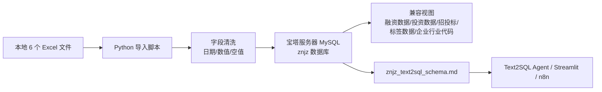

# 本地 Excel 导入宝塔 MySQL 操作手册

这份文档给同事看的目标很简单：把本地表格文件稳定导入宝塔面板服务器上的 MySQL 数据库，然后让 Text2SQL Agent、Streamlit 和 n8n 都能用这批数据查询。

当前 `znjz` 智能制造库的导入方式不是在宝塔网页里手工上传 Excel，而是在本地电脑运行 Python 脚本。脚本读取本地 6 个 Excel 文件，通过 MySQL 连接写入宝塔服务器数据库。这样可以重复执行、保留建表逻辑、统一日期和数值清洗，也方便出错后重跑。

## 1. 当前代码文件和数据文件

| 文件 | 用途 |
| --- | --- |
| `G:\text2sql_0705\scripts\import_znjz_excel_to_mysql.py` | 当前实际导入脚本：建表、读 Excel、清洗字段、写入 MySQL、创建兼容视图 |
| `G:\text2sql_0705\znjz_mysql_schema.sql` | 当前数据库建表 SQL 备份，可用于人工核对表结构 |
| `G:\text2sql_0705\znjz_gzldata_step1.xls` | 企业基本信息 |
| `G:\text2sql_0705\znjz_gzldata_step2.xlsx` | 企业基本信息 + 行业代码 |
| `G:\text2sql_0705\znjz_gzldata_step3.xlsx` | 企业融资信息 |
| `G:\text2sql_0705\znjz_gzldata_step4.xlsx` | 企业投资股东信息 |
| `G:\text2sql_0705\znjz_gzldata_step5.xlsx` | 招投标信息 |
| `G:\text2sql_0705\znjz_gzldata_step6.xlsx` | 商标资质信息 |
| `G:\text2sql-analysis\schema\znjz_text2sql_schema.md` | Text2SQL 知识库 schema，导入完成后 Agent 主要靠它理解数据库 |
| `G:\text2sql-analysis\scripts\test_db_simple.py` | 数据库连通性检查脚本 |

这个导入脚本默认按目录关系找文件：脚本在 `G:\text2sql_0705\scripts\`，6 个 Excel 在它的上一级目录 `G:\text2sql_0705\`。如果同事复制到别的电脑，要保持同样结构，例如 `D:\znjz_import\scripts\import_znjz_excel_to_mysql.py` 和 `D:\znjz_import\znjz_gzldata_step1.xls`。

后续如果要把导入脚本纳入正式项目维护，建议把 `G:\text2sql_0705\scripts\import_znjz_excel_to_mysql.py` 迁移到仓库的 `scripts/import_znjz_excel_to_mysql.py`，并把输入目录改成命令行参数。当前文档先按已经跑通过的本地脚本路径说明。

## 2. 导入链路



## 3. 宝塔面板先准备什么

在宝塔面板里进入“数据库”页面，确认或新建 MySQL 数据库：

| 配置项 | 当前 `znjz` 示例 |
| --- | --- |
| 数据库名 | `znjz` |
| 用户名 | `<数据库用户>` |
| 字符集 | `utf8mb4` |
| 端口 | `3306` |

如果脚本在你的本地电脑运行，而 MySQL 在宝塔服务器上，数据库用户必须允许远程访问。常见做法：

1. 宝塔数据库权限先临时设置为允许远程访问，或允许你的本机公网 IP。
2. 云服务器安全组临时放行 `3306`，只放行你的本机公网 IP 更安全。
3. 导入完成并确认 Streamlit 可访问后，再收紧权限。

不要把数据库密码写进 Git、共享文档、截图或聊天记录。命令示例里统一用 `<数据库密码>` 表示。

## 4. 本地电脑准备 Python 环境

进入项目仓库：

```powershell
cd G:\text2sql-analysis
```

安装项目依赖：

```powershell
python -m pip install -r requirements.txt
```

说明：

- `pandas` 负责读取 Excel。
- `pymysql` 负责连接 MySQL。
- `openpyxl` 负责读取 `.xlsx`。
- `xlrd` 负责读取旧格式 `.xls`，因为 `znjz_gzldata_step1.xls` 是 `.xls`。

## 5. 先做 dry-run

dry-run 只读取 6 个 Excel 并打印计划导入的表名、行数和字段数，不连接 MySQL。

```powershell
python G:\text2sql_0705\scripts\import_znjz_excel_to_mysql.py --dry-run
```

看到 6 个文件都能正常读取后，再执行真实导入。

## 6. 第一次导入或重建导入

第一次导入新库，或确认要清空重建这 6 张表时，用 `--replace`。

```powershell
$env:ZNJZ_DB_PASSWORD = Read-Host "Input MySQL password"
python G:\text2sql_0705\scripts\import_znjz_excel_to_mysql.py `
  --host <数据库主机> `
  --port 3306 `
  --user <数据库用户> `
  --database znjz `
  --password $env:ZNJZ_DB_PASSWORD `
  --replace
Remove-Item Env:\ZNJZ_DB_PASSWORD
```

`--replace` 会删除并重建目标表。使用前确认这不是生产库，或已经备份。

导入脚本会创建这些基础表：

| 表名 | 来源文件 |
| --- | --- |
| `企业基本信息` | `znjz_gzldata_step1.xls` |
| `企业基本信息_行业代码` | `znjz_gzldata_step2.xlsx` |
| `企业融资信息` | `znjz_gzldata_step3.xlsx` |
| `企业投资股东信息` | `znjz_gzldata_step4.xlsx` |
| `招投标信息` | `znjz_gzldata_step5.xlsx` |
| `商标资质信息` | `znjz_gzldata_step6.xlsx` |

脚本还会创建这些兼容视图：

| 视图名 | 用途 |
| --- | --- |
| `企业行业代码` | 兼容旧工作流的行业查询入口 |
| `融资数据` | 只保留真实融资事件 |
| `投资数据` | 只保留真实投资记录 |
| `招投标` | 只保留真实招投标记录 |
| `标签数据` | 只保留真实资质/标签记录 |

## 7. 已有数据时怎么选参数

导入脚本默认防重复：如果目标表已经有数据，而且你没有加参数，它会停止。

| 参数 | 适用场景 | 风险 |
| --- | --- | --- |
| 不加 `--append` / `--replace` | 空库第一次导入 | 如果表已有数据会停止 |
| `--replace` | 实验库重建、整批数据替换 | 会删除并重建目标表 |
| `--append` | 同结构数据追加 | 可能产生重复数据，必须确认业务口径 |
| `--skip-views` | 只导入基础表，不重建兼容视图 | Text2SQL 兼容旧字段时可能不可用 |
| `--batch-size 500` | 网络不稳定或单批写入过大 | 速度会慢一些 |

一般实验库换一整批数据，优先用 `--replace`。追加数据必须先确认没有重复主键或重复事件。

## 8. 导入后校验

可以用 MySQL 客户端、宝塔数据库管理工具，或任何 SQL 工具执行：

```sql
SELECT '企业基本信息' AS object_name, COUNT(*) AS rows_count, COUNT(DISTINCT eid) AS key_count FROM `企业基本信息`
UNION ALL
SELECT '企业基本信息_行业代码', COUNT(*), COUNT(DISTINCT eid) FROM `企业基本信息_行业代码`
UNION ALL
SELECT '企业融资信息', COUNT(*), COUNT(DISTINCT cf_id) FROM `企业融资信息` WHERE cf_id IS NOT NULL
UNION ALL
SELECT '企业投资股东信息', COUNT(*), COUNT(DISTINCT cinv_id) FROM `企业投资股东信息` WHERE cinv_id IS NOT NULL
UNION ALL
SELECT '招投标信息', COUNT(*), COUNT(DISTINCT cbid_id) FROM `招投标信息` WHERE cbid_id IS NOT NULL
UNION ALL
SELECT '商标资质信息', COUNT(*), COUNT(DISTINCT ct_id) FROM `商标资质信息` WHERE ct_id IS NOT NULL;
```

当前 `znjz` 这批数据的参考结果：

| 对象 | 行数/有效事件数 | 关键校验 |
| --- | ---: | --- |
| `企业基本信息` | 17,576 | `distinct eid = 17,576` |
| `企业基本信息_行业代码` | 17,576 | `industry_code` 非空约 17,557 |
| `企业融资信息` | 17,719 | 有效 `cf_id` 约 267 |
| `企业投资股东信息` | 21,980 | 有效 `cinv_id` 约 6,757 |
| `招投标信息` | 590,523 | 有效 `cbid_id` 约 576,690 |
| `商标资质信息` | 30,588 | 有效 `ct_id` 约 14,486 |

再检查兼容视图：

```sql
SHOW FULL TABLES WHERE Table_type = 'VIEW';
```

应该能看到：

- `企业行业代码`
- `融资数据`
- `投资数据`
- `招投标`
- `标签数据`

## 9. 检查项目能不能连上数据库

如果 `.env` 已配置 `DB_HOST_SCENARIO_1_3`、`DB_PORT_SCENARIO_1_3`、`DB_NAME_SCENARIO_1_3`、`DB_USER_SCENARIO_1_3`、`DB_PASSWORD_SCENARIO_1_3`，可以跑：

```powershell
cd G:\text2sql-analysis
python scripts\test_db_simple.py
```

Streamlit Cloud 部署时，这些值要放在 Streamlit Advanced settings 的 Secrets 里，不要提交到仓库。

## 10. 换新一批 Excel 时怎么改

### 文件名和字段完全一样

把新的 6 个文件替换到 `G:\text2sql_0705`，文件名保持不变，然后跑：

```powershell
python G:\text2sql_0705\scripts\import_znjz_excel_to_mysql.py --dry-run
```

确认行数和字段数没问题后，用 `--replace` 重建导入。

### 文件名变了

修改 `G:\text2sql_0705\scripts\import_znjz_excel_to_mysql.py` 里的 `TABLE_SPECS`：

```python
{
    "table": "企业基本信息",
    "file": "znjz_gzldata_step1.xls",
    ...
}
```

只改 `"file"` 即可，前提是字段结构没有变。

### 字段变了

需要同步改这些位置：

1. `TABLE_SPECS` 里的 `ddl`：新增、删除或改名字段。
2. `datetime_columns`：哪些字段要转成 `DATETIME`。
3. `epoch_ms_columns`：哪些时间字段是毫秒时间戳。
4. `NUMERIC_COLUMNS`：哪些字段按数值导入。
5. `TEXT_COLUMNS`：哪些字段按文本导入。
6. `COMPATIBILITY_VIEWS`：兼容视图是否还成立。
7. `G:\text2sql-analysis\schema\znjz_text2sql_schema.md`：Text2SQL 知识库必须同步更新。
8. `G:\text2sql-analysis\src\agent\profiles.py`：如果表名或视图名改变，白名单和提示词规则也要同步更新。

字段变更后不能只导入数据库就结束，否则 Agent 会继续按旧 schema 生成 SQL。

## 11. 常见问题

### 连接不上 MySQL

按顺序检查：

1. 宝塔数据库用户是否允许远程访问。
2. 云服务器安全组是否放行 `3306`。
3. MySQL 服务是否启动。
4. host、port、用户名、数据库名、密码是否正确。
5. 本机网络是否能访问服务器。

### 报 `Missing optional dependency 'xlrd'`

说明本地环境缺少读取 `.xls` 的库。执行：

```powershell
python -m pip install xlrd
```

### 中文表名乱码

确认数据库、连接和表都是 `utf8mb4`。导入脚本连接 MySQL 时已经设置 `charset="utf8mb4"`。

### 表里已经有数据，脚本停止

这是脚本的保护行为。确认要整批替换就加 `--replace`；确认要追加才加 `--append`。

### 导入很慢或中途断开

可以调小批量：

```powershell
python G:\text2sql_0705\scripts\import_znjz_excel_to_mysql.py --batch-size 500 ...
```

如果远程网络不稳定，也可以把 Excel 和脚本上传到服务器，在服务器本机跑，并把 host 改成 `127.0.0.1`。

## 12. 最小验收清单

导入完成后至少确认：

- 6 张基础表都存在。
- 5 个兼容视图都存在。
- 关键行数和 `schema/znjz_text2sql_schema.md` 的导入状态校验接近一致。
- `python scripts\test_db_simple.py` 能连上 `znjz`。
- Streamlit 页面能问一个简单问题，例如 `统计不同经营状态的企业数量`。
- 页面、日志、文档和 Git diff 中没有数据库密码、模型 Key 或服务器敏感配置。
